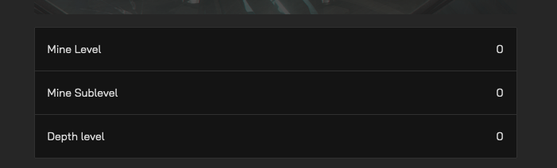

# KeyValueTable
## Example
```tsx
<KeyValueTable
    items={{
        [t('features.mining.mineLevel')]: mine?.level,
        [t('features.mining.mineSublevel')]: mine?.sub_level,
        [t('features.mining.depthLevel')]: mine?.layer_depth,
    }}
/>
```
### Result
